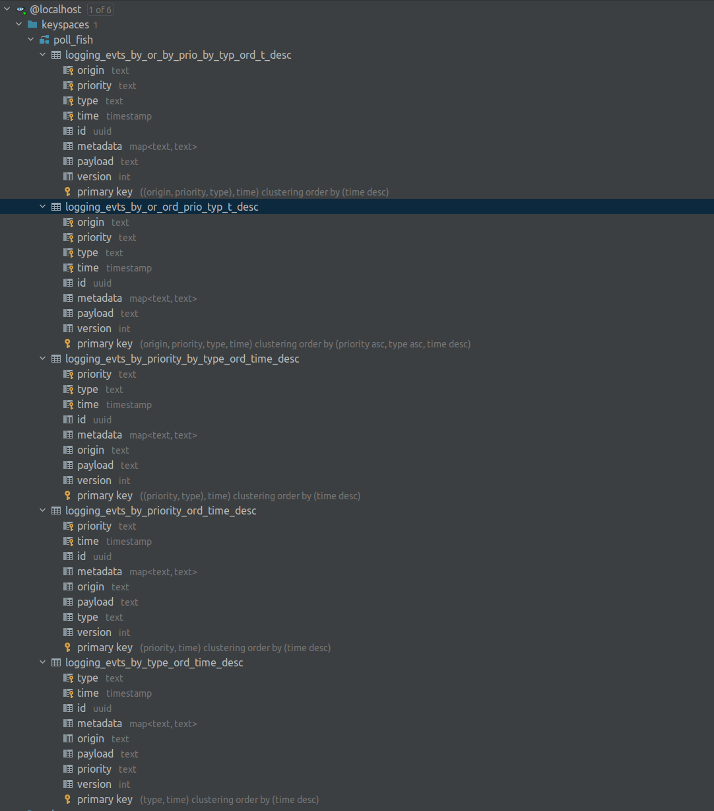

### Kafka Consumer (Logging-events-consumer)

#


#### Description
* The purpose of this module is to consume the log-event messages from kafka topics, and materialize them in Cassandra database
based on our query needs.


#### Important Notes:

* Do not remove `--##--` from [cassandra_db_setup.cql](src/main/resources/script/cassandra_db_setup.cql) it is needed from the parser during
initialization of the script, moreover if you want to introduce a new script, add it (`--##--`) before your script.


#### Tables supported - queries examples:


```cassandraql

-- 1
select * from poll_fish.logging_evts_by_priority_ord_time_desc
where priority = 'NORMAL';


-- 2
select * from poll_fish.logging_evts_by_priority_ord_time_desc
where priority = 'NORMAL' and time < '2020-11-26T19:25:19.694Z';

select * from poll_fish.logging_evts_by_type_ord_time_desc
where type = 'USER_INFO_EVENT' and time < '2020-11-26T19:25:19.694Z';


-- 3
select * from poll_fish.logging_evts_by_priority_by_type_ord_time_desc
where priority = 'CRITICAL' and type = 'TRANSACTION_EVENT' and time < '2020-11-30T19:25:19.694Z';


-- 4
select * from poll_fish.logging_evts_by_or_by_prio_by_typ_ord_t_desc
where origin = 'wallet_service_0' and priority = 'CRITICAL' and type = 'TRANSACTION_EVENT' and time < '2020-11-30T19:25:19.694Z';

select * from poll_fish.logging_evts_by_or_by_prio_by_typ_ord_t_desc
where origin = 'wallet_service_1' and priority = 'CRITICAL' and type = 'TRANSACTION_EVENT' and time < '2020-11-30T19:25:19.694Z';

select * from poll_fish.logging_evts_by_or_by_prio_by_typ_ord_t_desc
where origin = 'wallet_service_2' and priority = 'CRITICAL' and type = 'TRANSACTION_EVENT' and time < '2020-11-30T19:25:19.694Z';


-- 5
select * from poll_fish.logging_evts_by_or_ord_prio_typ_t_desc
where origin = 'wallet_service_2';

select * from poll_fish.logging_evts_by_or_ord_prio_typ_t_desc
where origin = 'wallet_service_2' and priority = 'CRITICAL';

```



